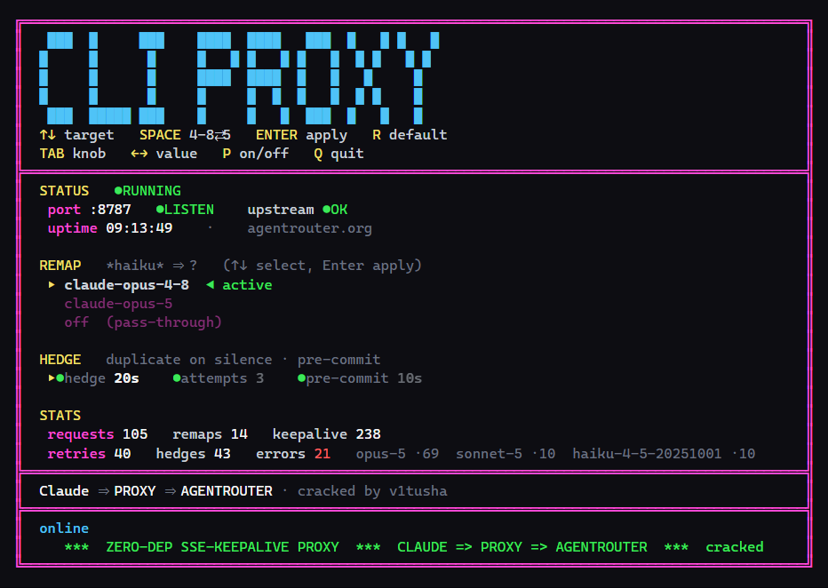

[English](README.md) | **Русский**

<div align="center">

<a href="https://t.me/xgateonline_bot?start=github"></a>

[](https://t.me/xgateonline_bot?start=github)
[](https://cabinet.xgate.online)
[](https://t.me/xgateonline_bot?start=github)

<sub>Проект бесплатный и живёт с подписок <b>XGATE</b>: свои ноды, IP без истории абуза — шлюзы, API и регистрации проходят.<br>
🤖 <a href="https://t.me/xgateonline_bot?start=github"><b>Telegram-бот @xgateonline_bot</b></a> · 🔑 <a href="https://cabinet.xgate.online"><b>Личный кабинет cabinet.xgate.online</b></a> · промокод <code>ABUSEHUB</code> — 3 дня бесплатно, дальше от 150 ₽/мес</sub>

</div>

<br>

# life-support

**Шлюз перестал дышать — прокси дышит за него.**

Локальный HTTP-прокси между Claude Code и Anthropic-совместимыми шлюзами
(например, agentrouter.org / New API), которые **не пересылают** `event: ping`
во время длинных thinking-пауз. Из-за этого idle-watchdog Claude Code (~18с без
единого байта — замерено) рвёт поток и ретраит запрос до бесконечности
(«Waiting for API response · will retry in ...»).

Прокси решает это четырьмя способами:

1. **Инжект пингов** — если от шлюза нет байт дольше `IDLE_MS`, прокси отдаёт
   клиенту настоящее `event: ping` — то самое событие, которое присылает API во
   время длинных пауз, так что клиент штатно признаёт его за признак жизни.
   Целое событие можно вставлять только на границе событий: если шлюз замолчал
   на середине, прокси пишет SSE-комментарий (`: keepalive`) — единственную
   строку, легальную внутри незакрытого события, ценой того, что её клиент
   вправе проигнорировать.
2. **Авто-ретрай** — транзиентные ошибки шлюза (401/403/429/5xx, например
   «unauthorized client detected» или ложный «Invalid token») прокси тихо
   повторяет сам с паузой, и Claude Code вообще не видит ошибку.
3. **Пре-коммит** — пинги можно инжектить только после того, как шлюз отдал
   заголовки ответа. Если он молчит дольше `PRE_COMMIT_MS`, прокси отдаёт
   SSE-заголовки сам и начинает капать пинги, а попытки продолжаются за
   кулисами. Стримовые запросы уходят к шлюзу с `accept-encoding: identity`:
   свои заголовки прокси отдаёт без сжатия, и сжатое тело от шлюза дошло бы до
   клиента мусором.
4. **Хеджирование** — после `HEDGE_MS` тишины прокси пускает дублирующий запрос
   параллельно и отдаёт того, кто ответил первым, остальных рвёт. У победителя
   релеятся настоящие статус и заголовки, ничего не подделывается.

Заголовки запросов релеются **без изменений** (шлюз фингерпринтит клиента:
`user-agent`, `x-app`, `x-stainless-*`, `anthropic-version`, `anthropic-beta`,
`authorization`); переписывается только `Host` на хост апстрима и
`accept-encoding` у стримовых запросов, как описано выше.
Токен нигде не логируется.

### Про хеджирование

Дубли платные и добавляют нагрузку. На шлюзе, которому не хватает каналов, они
делают хуже — это легко измеряется: с `HEDGE_MS=5000` и `MAX_ATTEMPTS=5` против
agentrouter вышло 2.4 дубля на запрос, а времена ответов выросли с 8с до 15–30с.
Откат до 20с / 2 попыток вернул 6–9с. Дефолты намеренно консервативные: хедж
здесь — страховка от висяка, а не ускоритель.

## Быстрый старт

Без npm-зависимостей, чистый Node.js (встроенные `http`/`https`/`stream`):

```
node proxy.js
node proxy.js selftest    # прогнать встроенные проверки и выйти
node test-hedge.js        # хедж и пре-коммит против фейкового тупящего шлюза
```

На Windows можно запускать двойным кликом по `proxy.bat` (лог пишется
в `proxy.log`).

## Консольный пультик

`panel.bat` открывает TUI против живого прокси: счётчики, цель ремапа и ручки
хеджа — всё без рестарта. Читает `GET /__state`, пишет `POST /__config`, и сам
поднимает прокси (скрыто), если порт мёртв.



| Клавиша | Действие |
|---|---|
| `↑` `↓` `ENTER` | выбрать и применить цель ремапа |
| `SPACE` | тумблер `claude-opus-4-8` ⇄ `claude-opus-5` |
| `TAB` `←` `→` | выбрать ручку хеджа и менять значение (применяется сразу) |
| `R` | вернуть цель по умолчанию |
| `P` | запустить / остановить прокси |
| `Q` | выход — прокси продолжает работать |

Ручки шагают по готовым значениям, а не свободной арифметикой: случайным
нажатием нельзя выставить `hedgeMs`, который завалит шлюз дублями.

PowerShell 5.1 требует, чтобы `panel.ps1` лежал в UTF-8 **с BOM**, иначе
псевдографика и стрелки превращаются в кракозябры. `panel.ps1 -SelfTest`
проверяет шаги ручек и инвариант рамки (каждая строка ровно по ширине рамки,
иначе длинная строка переносится и кадр уезжает вниз); `-Once` рисует один кадр
и выходит. `PANEL_COLS` / `PANEL_ROWS` — отрисовать под размер, отличный от
твоего окна.

## Ремап модели

Claude Code сам дёргает `claude-haiku-4-5-*` под фоновые задачи. Если токен эту
модель не пускает, шлюз отвечает `403 该令牌无权访问模型`, и сессия встаёт.
Прокси переписывает любое имя модели, содержащее `HAIKU_MATCH`, на `HAIKU_MODEL`
и правит `content-length`. Выключается через `HAIKU_MODEL=off`.

Классификатор ретраев знает и постоянные ошибки New API на китайском
(无权 / 过期 / 余额 / 额度 / 不存在 / 封禁 …) и не тратит на них попытки.

## Переключение Claude Code

Отредактируй `~/.claude/settings.json` (Windows:
`C:\Users\<you>\.claude\settings.json`):

```json
{
  "env": {
    "ANTHROPIC_BASE_URL": "http://127.0.0.1:8787",
    "ANTHROPIC_AUTH_TOKEN": "sk-...",
    "ANTHROPIC_MODEL": "claude-opus-4-8"
  }
}
```

Меняй только `ANTHROPIC_BASE_URL` на `http://127.0.0.1:8787`;
`ANTHROPIC_AUTH_TOKEN` и `ANTHROPIC_MODEL` оставь как были.
Полностью перезапусти Claude Code.

Десктопная версия Claude Code читает тот же `settings.json`, так что фикс
работает и там. Чат-приложение Claude Desktop использует собственный шлюз
в настройках — туда можно вписать `http://127.0.0.1:8787`, если хочешь гонять
и его через прокси.

Учти: рестарт прокси убивает пул keep-alive сокетов клиента, поэтому первый
запрос в каждом открытом окне падает один раз с `ECONNRESET` («check your
network»). Нажми Esc и отправь заново. Именно поэтому значимые настройки
меняются на лету — см. ниже.

## Настройки на лету

| Endpoint | |
|---|---|
| `GET /__state` | конфиг, апстрим и счётчики в JSON |
| `POST /__config` | патч `remapModel`, `remapMatch`, `hedgeMs`, `maxAttempts`, `preCommitMs` |

Значения из патча зажимаются в разумные рамки и пишутся в `config.json`, который
при следующем старте имеет приоритет над окружением.

```
curl -X POST http://127.0.0.1:8787/__config \
  -H 'content-type: application/json' -d '{"hedgeMs":20000,"maxAttempts":2}'
```

## Конфигурация через env

| Переменная | По умолчанию | Описание |
|---|---|---|
| `PORT` | `8787` | Порт прокси |
| `UPSTREAM` | `https://agentrouter.org` | URL шлюза |
| `IDLE_MS` | `5000` | Порог молчания шлюза перед инжектом пинга |
| `UPSTREAM_TIMEOUT_MS` | `90000` | Сколько ждать заголовки ответа, прежде чем оборвать попытку (`0` = ждать вечно) |
| `PRE_COMMIT_MS` | `10000` | Тишина, после которой прокси сам отдаёт SSE-заголовки (`0` = выкл) |
| `HEDGE_MS` | `20000` | Тишина, после которой пускается параллельный дубль (`0` = выкл) |
| `MAX_ATTEMPTS` | `2` | Всего попыток на запрос — хеджи и ретраи делят один бюджет |
| `RETRY_DELAY_MS` | `1500` | Пауза перед повтором после транзиентной ошибки |
| `HAIKU_MODEL` | `claude-opus-4-8` | Цель ремапа модели (`off` = выкл) |
| `HAIKU_MATCH` | `haiku` | Подстрока в имени модели, включающая ремап |
| `CONFIG_FILE` | `config.json` | Файл runtime-конфига, который пишет панель |
| `LOG_FILE` | (пусто) | Путь к файлу лога (stderr дублируется туда) |

Пример:

```
PORT=9000 UPSTREAM=https://other-gateway.example IDLE_MS=3000 node proxy.js
```

## Чтение лога

Сообщения лога — на английском.

```
>> POST /v1/messages start                             запрос получен
model remap claude-haiku-4-5-x -> claude-opus-5        ремап применён
attempt #1 bounced 500: ...无可用渠道...               транзиентная ошибка, попытка выбыла
hedge: 20016ms of silence, firing duplicate #2         тишина, пущен дубль
duplicates aborted: 1                                  победитель найден, лишние оборваны
POST /v1/messages -> 200 (SSE) 21967ms                 шлюз ответил
pre-commit SSE (gateway silent for 10016ms)            заголовки отдал прокси
POST /v1/messages ping #2                              отдан event: ping
keepalive mid-event #3                                 комментарий: шлюз замолчал в середине события
stream closed normally: 12446b in 13840ms              поток дошёл до конца
CLIENT CLOSED the connection at 0b after 17833ms       клиент сдался до первого байта
GATEWAY TRUNCATED the stream at 4096b after 45000ms    шлюз обрезал поток на полпути
all 2 attempts missed: ...                             все попытки провалились, клиенту 502
client error: ECONNRESET                               обрыв на уровне соединения
```

`count_tokens -> 404` — это норма: многие шлюзы не реализуют этот endpoint.

Последние три строки — единственные случаи, когда ошибку реально видит клиент;
за ними и стоит следить.

## Лицензия

MIT
